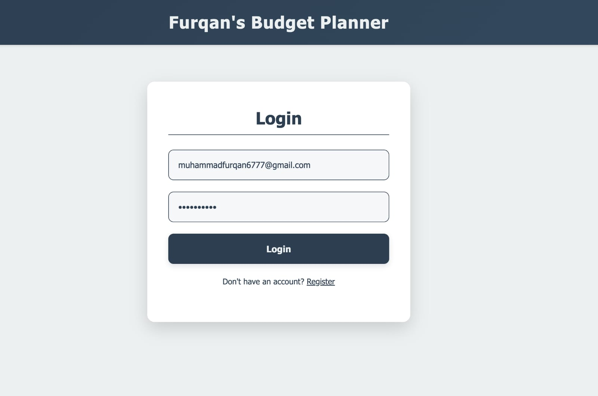
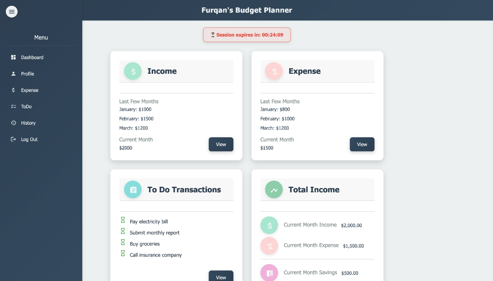
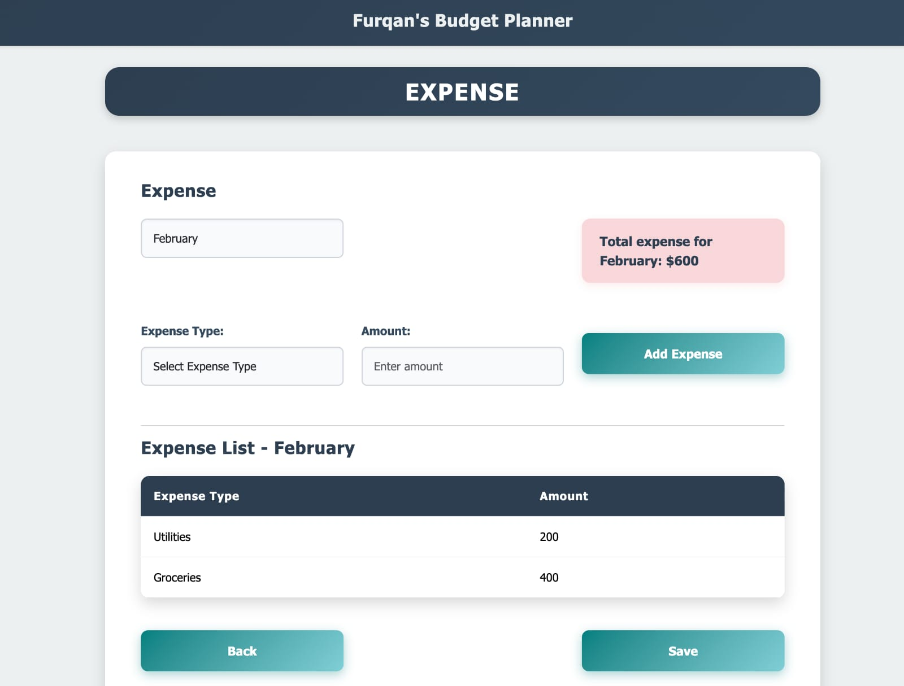
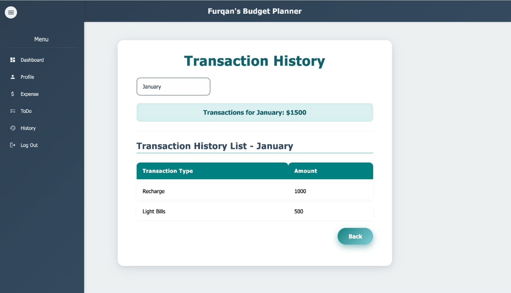

# Budget Planner Angular

A comprehensive budget planning and tracking application built with Angular 17. This application helps users manage their finances by tracking income, expenses, transactions, and maintaining a todo list for financial tasks.

## 📋 Table of Contents

- [Features](#features)
- [Tech Stack](#tech-stack)
- [Project Structure](#project-structure)
- [Installation](#installation)
- [Usage](#usage)
- [Screenshots](#screenshots)
- [Components Overview](#components-overview)
- [Authentication & Security](#authentication--security)

## ✨ Features

- **User Authentication**: Secure login and registration system with session management
- **Dashboard**: Overview of income, expenses, and savings with session timer
- **Income Tracking**: Add and manage income sources by month with investment tracking
- **Expense Tracking**: Track expenses by category and month
- **Transaction History**: View detailed transaction history across all months
- **Todo List**: Manage financial tasks and reminders
- **Profile Management**: Update and manage user profile information
- **Session Management**: Automatic session timeout with countdown timer
- **Route Guards**: Protected routes using authentication guards
- **Responsive Design**: Modern UI built with Angular Material and Bootstrap

## 🛠️ Tech Stack

- **Framework**: Angular 17
- **Language**: TypeScript
- **UI Libraries**: 
  - Angular Material
  - Bootstrap 5.3.2
- **State Management**: RxJS Observables
- **Routing**: Angular Router with lazy loading
- **Forms**: Reactive Forms
- **Server-Side Rendering**: Angular SSR support

## 📁 Project Structure

```
Budget_Planner_Angular/
├── BUDGET PLANNER/
│   └── src/
│       └── app/
│           ├── app.component.ts
│           ├── app.routes.ts
│           └── budget-planner/
│               ├── dashboard/          # Dashboard component
│               ├── login/              # Login/Register component
│               ├── income/             # Income tracking component
│               ├── expense/            # Expense tracking component
│               ├── history/            # Transaction history component
│               ├── todo/               # Todo list component
│               ├── profile/            # User profile component
│               ├── side-nav/           # Side navigation component
│               ├── guards/             # Route guards (AuthGuard)
│               ├── services/           # Services (Auth, Session)
│               ├── budget-planner.module.ts
│               └── budget-planner-routing.module.ts
└── DOCS/                              # Documentation images
```

## 🚀 Installation

1. **Clone the repository**
   ```bash
   git clone https://github.com/FurqanMujahid/Budget_Planner_Angular.git
   cd Budget_Planner_Angular
   ```

2. **Navigate to the project directory**
   ```bash
   cd "BUDGET PLANNER"
   ```

3. **Install dependencies**
   ```bash
   npm install
   ```

4. **Start the development server**
   ```bash
   npm start
   ```

5. **Open your browser**
   Navigate to `http://localhost:4200`

## 💻 Usage

### Login/Registration
- Access the application through the login page
- Register a new account or login with existing credentials
- Session token is stored in localStorage

### Dashboard
- View overview of current month's income and expenses
- See savings calculation (Income - Expenses)
- Monitor session countdown timer
- Quick navigation to Income, Expense, and Todo sections

### Income Management
- Select a month from the dropdown
- Add income sources with amount and investment type
- View total income for selected month
- Track multiple income sources per month

### Expense Management
- Select a month to view/add expenses
- Categorize expenses by type (Rent, Groceries, Utilities, etc.)
- Track expense amounts
- Calculate total expenses per month

### Transaction History
- View comprehensive transaction history across all 12 months
- Filter transactions by month
- See detailed breakdown of expenses by category

### Todo List
- Manage financial tasks and reminders
- Organize todos by month
- Mark tasks as complete

### Profile
- Update personal information
- Manage user details (name, age, DOB, gender, occupation, email, address, contact)

## 📸 Screenshots

### Login Page


### Dashboard with Session Timer


### Expense Tracker


### Transaction History


## 🧩 Components Overview

### Dashboard Component
- Displays current month income and expenses
- Shows last 3 months' financial data
- Displays todo transactions
- Calculates and shows current month savings
- Session countdown timer integration

### Login Component
- Login and registration forms
- Form validation
- Token generation and storage
- Session initialization
- Navigation to dashboard after successful login

### Income Component
- Month-based income tracking
- Support for multiple income sources
- Investment type tracking
- Total income calculation per month

### Expense Component
- Month-based expense tracking
- Expense categorization
- Total expense calculation
- Form validation

### History Component
- Complete transaction history for all 12 months
- Month-wise filtering
- Detailed expense breakdown
- Total calculations per month

### Todo Component
- Financial task management
- Month-based organization
- Task selection and tracking

### Profile Component
- User profile form
- Personal information management
- Form validation with error messages

### Side Navigation Component
- Navigation menu for all sections
- Consistent UI across pages

## 🔐 Authentication & Security

### AuthGuard
- Protects routes from unauthorized access
- Checks authentication status before route activation
- Redirects to login if not authenticated

### AuthService
- Manages authentication state
- Token validation and expiration checking
- Logout functionality

### SessionService
- Manages user sessions
- Automatic session timeout (30 minutes default)
- Real-time countdown timer
- Automatic logout on session expiration
- Session cleanup on logout

### Token Management
- JWT-like token stored in localStorage
- Token includes email, timestamp, and expiration
- Automatic token validation on app initialization

## 📝 Development

### Build for Production
```bash
npm run build
```

### Run Tests
```bash
npm test
```

### Server-Side Rendering
```bash
npm run serve:ssr:budget-planner
```

## 🤝 Contributing

Contributions are welcome! Please feel free to submit a Pull Request.

## 📄 License

This project is open source and available under the [MIT License](LICENSE).

## 👤 Author

Muhammad Furqan 
---

